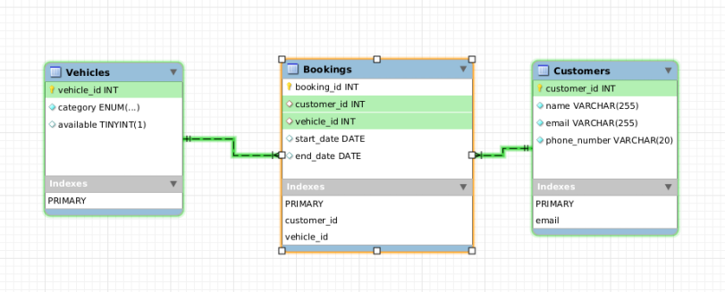
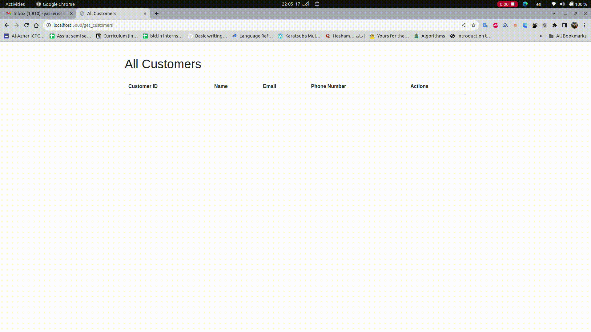

# Car-Hire-Management-System-task
 This is a task for managing a car rental service. The task is just limited to specially allows users to view, add, update, and delete customer information. The application is built using Flask, a lightweight Python web framework, and utilizes MySQL as the database management system. Docker is used to containerize the application and the database.

## Table of Contents
- [Features](#features)
- [Project Setup](#project-setup)
- [API-ENDPOINTS](#api-endpoints)
- [ER Diagram](#er-diagram)
- [Explanation](#explanation)
- [SQL Statements](#sql-statements)
- [Demo](#demo)

## Features
- [x] User can view all customers
- [x] User can view an individual customer
- [x] User can add a new customer
- [x] User can update an existing customer
- [x] User can delete a customer    

## Project Setup

```bash
# Clone the repo
git clone https://github.com/yaaa3ser/Car-Hire-Management-System-task.git
cd Car-Hire-Management-System-task
```

To run the project, you will need to have Docker and Docker Compose installed on your machine. Once you have installed the required dependencies, you can run the following command to start the web service and the database:

```bash
docker-compose up --build
```
you can access the web app at 'http://localhost:5000'


## API-ENDPOINTS

| Endpoint | Method | Description |
| --- | --- | --- |
| `/get_customers` | GET | Get all customers |
| `/get_customer/<id>` | GET | Get a single customer |
| `/add_customer` | POST | Add a new customer |
| `/update_customer/<id>` | PUT | Update a customer |
| `/delete_customer/<id>` | DELETE | Delete a customer |


## ER Diagram



## Explanation
- A customer has a name, email, and phone number.
- A vehicle has a category and availability.
- we need a many-to-many relationship between customers and vehicles, so we need a third table to represent this relationship, which is the Bookings table and it has a foreign key to the customer_id and vehicle_id.
- we need to make sure that a customer can't book for more than a week, so we add a check constraint to the end_date column in the Bookings table.


## SQL Statements
```sql
CREATE DATABASE car_rental;
use car_rental;

CREATE TABLE Customers (
    customer_id INT PRIMARY KEY AUTO_INCREMENT,
    name VARCHAR(255) NOT NULL,
    email VARCHAR(255) NOT NULL UNIQUE,
    phone_number VARCHAR(20) NOT NULL
);

CREATE TABLE Vehicles (
    vehicle_id INT PRIMARY KEY AUTO_INCREMENT,
    category ENUM('small_car', 'family_car', 'van') NOT NULL,
    available BOOLEAN DEFAULT TRUE
);

CREATE TABLE Bookings (
    booking_id INT PRIMARY KEY AUTO_INCREMENT,
    customer_id INT,
    vehicle_id INT,
    start_date DATE,
    end_date DATE,
    FOREIGN KEY (customer_id) REFERENCES Customers(customer_id),
    FOREIGN KEY (vehicle_id) REFERENCES Vehicles(vehicle_id),
    -- to make sure that a customer can't book for more than a week
    CHECK (end_date <= DATE_ADD(start_date, INTERVAL 7 DAY)) 
);
```

## Demo
